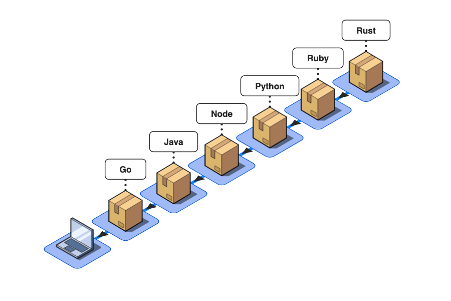

<div id="top"></div>
<!--
*** Thanks for checking out the Best-README-Template. If you have a suggestion
*** that would make this better, please fork the repo and create a pull request
*** or simply open an issue with the tag "enhancement".
*** Don't forget to give the project a star!
*** Thanks again! Now go create something AMAZING! :D
-->


<!-- PROJECT SHIELDS -->
<!--
*** I'm using markdown "reference style" links for readability.
*** Reference links are enclosed in brackets [ ] instead of parentheses ( ).
*** See the bottom of this document for the declaration of the reference variables
*** for contributors-url, forks-url, etc. This is an optional, concise syntax you may use.
*** https://www.markdownguide.org/basic-syntax/#reference-style-links
-->
[![Contributors][contributors-shield]][contributors-url]
[![Forks][forks-shield]][forks-url]
[![Stargazers][stars-shield]][stars-url]
[![Issues][issues-shield]][issues-url]
[![MIT License][license-shield]][license-url]
[![LinkedIn][linkedin-shield]][linkedin-url]


<!-- PROJECT LOGO -->
<br />
<div align="center">
  <a href="https://github.com/certifiedcloudarchitect/macos-config">
    
  </a>

<h3 align="center">macos-config</h3>

  <p align="center">
    A repository for configuring a new MacBook Pro with development tools.
    <br />
    <a href="https://github.com/certifiedcloudarchitect/macos-config"><strong>Explore the docs »</strong></a>
    <br />
    <br />
    <a href="https://github.com/certifiedcloudarchitect/macos-config">View Demo</a>
    ·
    <a href="https://github.com/certifiedcloudarchitect/macos-config/issues">Report Bug</a>
    ·
    <a href="https://github.com/certifiedcloudarchitect/macos-config/issues">Request Feature</a>
  </p>
</div>


<!-- TABLE OF CONTENTS -->
<details>
  <summary>Table of Contents</summary>
  <ol>
    <li>
      <a href="#about-the-project">About The Project</a>
      <ul>
        <li><a href="#built-with">Built With</a></li>
      </ul>
    </li>
    <li>
      <a href="#getting-started">Getting Started</a>
      <ul>
        <li><a href="#prerequisites">Prerequisites</a></li>
        <li><a href="#installation">Installation</a></li>
      </ul>
    </li>
    <li><a href="#usage">Usage</a></li>
    <li><a href="#roadmap">Roadmap</a></li>
    <li><a href="#contributing">Contributing</a></li>
    <li><a href="#license">License</a></li>
    <li><a href="#contact">Contact</a></li>
    <li><a href="#acknowledgments">Acknowledgments</a></li>
  </ol>
</details>


<!-- ABOUT THE PROJECT -->
## About The Project

<div align="center">
  <a href="https://github.com/certifiedcloudarchitect/macos-config">
    
  </a>
</div>

This project was developed inorder to help expedite the provisioning of development tools and configurations.

<p align="right">(<a href="#top">back to top</a>)</p>


### Built With

* [Command line tools for Xcode](https://developer.apple.com/xcode/)
* [Homebrew](https://brew.sh/)
* [Zsh](https://www.zsh.org/)
* [Oh My Zsh](https://ohmyz.sh/)
* [Powerlevel10k](https://github.com/romkatv/powerlevel10k)
* [Zsh](https://www.zsh.org/)
* [OpenSSH](https://www.openssh.com/)
* [GnuPG](https://gnupg.org/)

<p align="right">(<a href="#top">back to top</a>)</p>


<!-- GETTING STARTED -->
## Getting Started

Inorder to get started you will need to have a newly provisioned macOS.  This has been tested on a MacBook Pro (Intel) with Monterey version 12.2. 

### Prerequisites

You should review the scripts to understand what the configurations are providing.  You can toggle tools and configurations on and offf using boolean values (true, false).
* `install.sh`
  ```sh
  bash ./setup-scripts/install-kubectl.sh "false"
  ```

### Installation

1. Get a free GitHub account at [https://github.com/](https://github.com/)
2. Clone the repo
   ```sh
   git clone https://github.com/certifiedcloudarchitect/macos-config.git
   ```
3. Install the tools and configurations
   ```sh
   source install.sh
   ```
4. Enter a new password when prompted for new SSH and GPG key.
5. Your public keys will be printed to the console at the end of the process for use with GitHub.
6. You will need to reboot the OS.
7. Once the OS has been rebooted you need to run  the `post-install.sh` script in the setup-scripts folder to complete the configurations.
   ```sh
   source post-install.sh
   ```


<p align="right">(<a href="#top">back to top</a>)</p>


<!-- USAGE EXAMPLES -->
## Usage

Use this space to show useful examples of how a project can be used. Additional screenshots, code examples and demos work well in this space. You may also link to more resources.

_For more examples, please refer to the [Documentation](https://github.com/certifiedcloudarchitect/macos-config/blob/main/README.md)_

<p align="right">(<a href="#top">back to top</a>)</p>


<!-- ROADMAP -->
## Roadmap

- [X] Provision standard toolset
- [ ] Provision additional macOS settings
- [ ] Add additonal tools and configurations
    - [ ] Visual Studio Code configurations
    - [ ] Machine Learning toolsets

See the [open issues](https://github.com/certifiedcloudarchitect/macos-config/issues) for a full list of proposed features (and known issues).

<p align="right">(<a href="#top">back to top</a>)</p>


<!-- CONTRIBUTING -->
## Contributing

Contributions are what make the open source community such an amazing place to learn, inspire, and create. Any contributions you make are **greatly appreciated**.

If you have a suggestion that would make this better, please fork the repo and create a pull request. You can also simply open an issue with the tag "enhancement".
Don't forget to give the project a star! Thanks again!

1. Fork the Project
2. Create your Feature Branch (`git checkout -b feature/AmazingFeature`)
3. Commit your Changes (`git commit -m 'Add some AmazingFeature'`)
4. Push to the Branch (`git push origin feature/AmazingFeature`)
5. Open a Pull Request

<p align="right">(<a href="#top">back to top</a>)</p>


<!-- LICENSE -->
## License

Distributed under the MIT License. See `LICENSE` for more information.

<p align="right">(<a href="#top">back to top</a>)</p>


<!-- CONTACT -->
## Contact

Project Link: [https://github.com/certifiedcloudarchitect/macos-config](https://github.com/certifiedcloudarchitect/macos-config)

<p align="right">(<a href="#top">back to top</a>)</p>


<!-- MARKDOWN LINKS & IMAGES -->
<!-- https://www.markdownguide.org/basic-syntax/#reference-style-links -->
[contributors-shield]: https://img.shields.io/github/contributors/certifiedcloudarchitect/github-template-repo.svg?style=for-the-badge
[contributors-url]: https://github.com/certifiedcloudarchitect/macos-config/graphs/contributors
[forks-shield]: https://img.shields.io/github/forks/certifiedcloudarchitect/github-template-repo.svg?style=for-the-badge
[forks-url]: https://github.com/certifiedcloudarchitect/macos-config/network/members
[stars-shield]: https://img.shields.io/github/stars/certifiedcloudarchitect/github-template-repo.svg?style=for-the-badge
[stars-url]: https://github.com/certifiedcloudarchitect/macos-config/stargazers
[issues-shield]: https://img.shields.io/github/issues/certifiedcloudarchitect/github-template-repo.svg?style=for-the-badge
[issues-url]: https://github.com/certifiedcloudarchitect/macos-config/issues
[license-shield]: https://img.shields.io/github/license/certifiedcloudarchitect/github-template-repo.svg?style=for-the-badge
[license-url]: https://github.com/certifiedcloudarchitect/macos-config/blob/master/LICENSE.txt
[linkedin-shield]: https://img.shields.io/badge/-LinkedIn-black.svg?style=for-the-badge&logo=linkedin&colorB=555
[linkedin-url]: https://linkedin.com/in/certifiedcloudarchitect
[product-screenshot]: images/screenshot.png